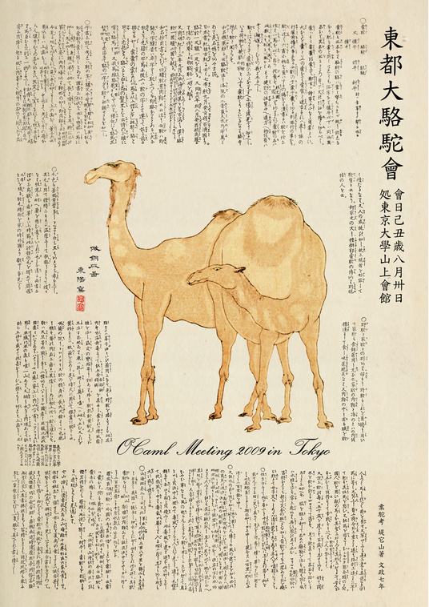
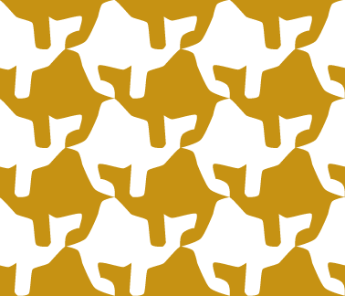
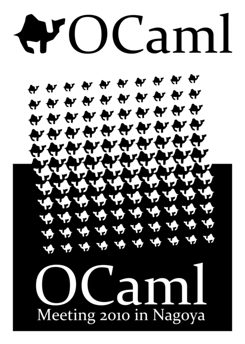
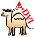
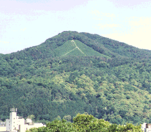
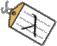

# Art

## OCaml Meeting 2009 in Tokyo Poster (東都大駱駝會)

  
OCaml Meeting 2009 in Tokyo poster by Jun Furuse is licensed under a Creative Commons 表示-非営利-継承 2.1 日本 License.
Based on a work of 槖駝考 堤它山 文政七年.

## Camel Tiling

  
Camel Tiling by Jun Furuse is licensed under a Creative Commons 表示-非営利-継承 2.1 日本 License.

## OCaml Meeting 2010 in Nagoya

  
OCaml Meeting 2010 in Nagoya poster and t-shirt design by Jun Furuse is licensed under a Creative Commons 表示-非営利-継承 2.1 日本 License.

## And some very old things, found in the web space:

### ADvi logo (around 2001)

  
Logo for ADvi ( http://advi.inria.fr ), DVI previewer + presenter. The original drawing was done in less than 30 secs using a 筆ペン ( http://www.pentel.co.jp/fude/ ). The animated GIF is created one of the first Macromedia FLASH editor.

### Mount Lambda (around 1997)

  
This is created for the web site of the functional language research group at RIMS probably around 1997. The page still exists http://wwwfun.kurims.kyoto-u.ac.jp/MtLambda.html with my original joke about the mountain. Probably one of my first joke in English in the web space :-) I do not remember how I got the original photo... My first digital camera? Scraped an existing image file in the web? Scanned a real photo? 

### Labl-light logo (around 1997)

  
The logo of Labl-light, a modified version of Caml-light compiler with labeled arguments. It is also used for OLabl, a port to OCaml.
http://www.math.nagoya-u.ac.jp/~garrigue/soft/olabl/
